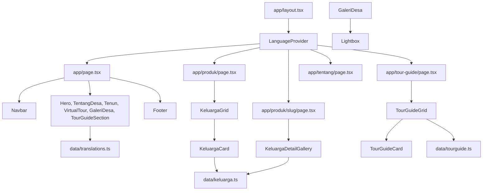

# Dokumentasi Virtual Web Desa Adat Tenganan

## 1. Gambaran Umum

Virtual Web adalah website informasi dan promosi Desa Adat Tenganan Pegringsingan. Website ini menggabungkan:

- Informasi sejarah, budaya, tradisi, visi, dan misi desa.
- Informasi kain tenun Gringsing dan produk tenun keluarga penenun.
- Galeri foto budaya, alam, festival, dan tenun.
- Tampilan tur virtual 360 derajat.
- Daftar pemandu wisata lokal.
- Kontak pemesanan produk dan pemandu melalui WhatsApp.
- Dukungan dua bahasa: Bahasa Indonesia (`id`) dan Bahasa Inggris (`en`).

Website bersifat statis dari sisi sumber data. Data produk, keluarga penenun, pemandu, dan teks halaman disimpan di dalam source code, bukan di database atau CMS.

## 2. Teknologi Utama

- **Next.js `16.2.10`** dengan App Router.
- **React `19.2.4`** untuk komponen antarmuka dan interaksi client-side.
- **TypeScript `5`** dengan mode strict.
- **Tailwind CSS `4`** melalui `@tailwindcss/postcss`.
- **Next Image** untuk optimasi gambar pada komponen yang menggunakan `next/image`.
- **WhatsApp URL** (`https://wa.me/...`) sebagai jalur kontak/pemesanan.

Tidak ada backend, API internal, autentikasi, database, atau payment gateway pada versi saat ini.

## 3. Struktur Folder Penting

```text
virtual-web/
|-- app/                         # Route dan halaman Next.js App Router
|   |-- layout.tsx               # Root layout, metadata global, LanguageProvider
|   |-- page.tsx                 # Beranda dan susunan seluruh section
|   |-- globals.css               # Tailwind import, warna, font, animasi global
|   |-- produk/
|   |   |-- page.tsx             # Daftar keluarga penenun
|   |   `-- [slug]/page.tsx      # Detail keluarga penenun berdasarkan slug
|   |-- tentang/page.tsx         # Halaman informasi desa dengan tab Tentang/Visi Misi
|   `-- tour-guide/page.tsx      # Daftar pemandu wisata
|
|-- components/
|   |-- layout/                  # Navbar, footer, dan helper navigasi
|   |-- sections/                # Section yang dirender di beranda
|   |-- produk/                  # Card, grid, heading, dan galeri detail produk
|   |-- tourguide/               # Card, grid, dan heading pemandu wisata
|   |-- gallery/                 # Lightbox untuk galeri foto
|   `-- icons/                   # Ikon media sosial
|
|-- context/
|   `-- LanguageContext.tsx      # State bahasa global dan hook useLanguage
|
|-- data/
|   |-- keluarga.ts              # Data utama keluarga dan kategori kain tenun
|   |-- tourguide.ts             # Data pemandu wisata
|   |-- translations.ts          # Seluruh teks id/en
|   `-- produk.ts                # Data produk model lama/alternatif, belum dipakai route aktif
|
|-- types/                       # Interface TypeScript untuk data aplikasi
|-- public/images/               # Gambar yang diakses dengan path /images/...
|-- lib/utils.ts                 # Utility umum
|-- next.config.ts               # Konfigurasi Next.js
|-- tsconfig.json                # Konfigurasi TypeScript dan alias @/*
|-- postcss.config.mjs           # Integrasi PostCSS/Tailwind
|-- eslint.config.mjs            # Konfigurasi linting
`-- package.json                 # Dependensi dan script npm
```

## 4. Rute dan Halaman

### `/` - Beranda

Dirender oleh `app/page.tsx`. Urutan kontennya adalah:

1. `Navbar`
2. `Hero` dengan anchor `#beranda`
3. `TentangDesa` dengan anchor `#tentang`
4. `Tenun` dengan anchor `#tenun`
5. `VirtualTour` dengan anchor `#virtual-tour`
6. `GaleriDesa` dengan anchor `#galeri`
7. `TourGuideSection` dengan anchor `#tour-guide`
8. `Footer`

`KontakLokasi` tersedia sebagai komponen, tetapi saat ini masih dikomentari di `app/page.tsx`, sehingga belum tampil di beranda.

### `/produk` - Katalog Tenun

`app/produk/page.tsx` mengambil `keluargaList` dari `data/keluarga.ts` lalu meneruskannya ke `KeluargaGrid`.

Setiap `KeluargaCard` menampilkan:

- Foto pertama dari kategori pertama.
- Nama keluarga penenun.
- Daftar kategori tenun.
- Rentang harga termurah sampai termahal.
- Link detail keluarga.
- Tombol WhatsApp langsung ke nomor keluarga tersebut.

### `/produk/[slug]` - Detail Keluarga Penenun

`app/produk/[slug]/page.tsx` memakai dynamic route. `generateStaticParams()` membuat halaman statis untuk setiap `slug` di `keluargaList`.

Alur detail:

1. `slug` dibaca dari parameter route.
2. `getKeluargaBySlug(slug)` mencari data keluarga.
3. Jika data tidak ditemukan, Next.js menjalankan `notFound()`.
4. Data diteruskan ke `KeluargaDetailGallery`.
5. Pengunjung dapat berganti kategori, melihat harga/deskripsi, dan menghubungi penenun lewat WhatsApp dengan pesan otomatis.

### `/tentang` - Tentang Desa

`app/tentang/page.tsx` adalah client component karena menggunakan `useState`. Halaman ini menyediakan dua tab:

- **Tentang**: informasi panjang mengenai sejarah, tradisi, kehidupan masyarakat, dan posisi Tenganan sebagai destinasi budaya.
- **Visi & Misi**: visi desa dan daftar misi.

Isi tab berasal dari `translations.ts`, sehingga ikut berubah ketika bahasa diganti.

### `/tour-guide` - Daftar Pemandu Wisata

`app/tour-guide/page.tsx` mengambil `tourGuideList`, lalu menampilkan `TourGuidePageHeading` dan `TourGuideGrid`.

`TourGuideCard` menampilkan foto, nama, usia, dan tombol WhatsApp untuk menghubungi pemandu.

## 5. Arsitektur Komponen



### Layout dan Navigasi

- `Navbar` dipakai di beranda. Link desktop melakukan smooth scroll ke section beranda dan memantau section aktif memakai `IntersectionObserver`.
- `NavbarDetail` dipakai pada halaman selain beranda. Link-nya menggunakan format `/#section` agar kembali ke beranda lalu menuju section terkait.
- Keduanya memiliki toggle bahasa dan drawer menu untuk tampilan mobile.
- Saat drawer mobile terbuka, scroll pada `body` dikunci.
- `ScrollToHash` tersedia sebagai helper untuk menangani perpindahan ke anchor, jika diperlukan oleh halaman lain.

### Section Beranda

- `Hero`: gambar latar utama, judul, subtitle, dan CTA ke bagian Tentang/Tur Virtual.
- `TentangDesa`: ringkasan desa, gambar desa, dan link ke `/tentang`.
- `Tenun`: informasi sejarah dan nilai budaya kain Gringsing serta link ke `/produk`.
- `VirtualTour`: frame visual tur virtual dengan prompt audio dan menu overlay. Implementasi saat ini masih berupa tampilan interaktif berbasis gambar latar, bukan embed engine panorama 360 yang sesungguhnya.
- `GaleriDesa`: filter kategori, grid foto, pembatasan maksimal delapan foto yang terlihat, dan `Lightbox`.
- `TourGuideSection`: pengantar pemandu wisata dan link ke `/tour-guide`.
- `KontakLokasi`: komponen peta Google Maps yang tersedia tetapi belum dirender di beranda.
- `Footer`: CTA ke tur virtual, alamat, jam buka, kontak, ikon sosial, dan copyright.

## 6. Data dan TypeScript Model

### Keluarga dan Produk Tenun

Model utama ada di `types/keluarga.ts`:

```ts
interface LocalizedText {
  id: string;
  en: string;
}

interface KategoriTenun {
  id: string;
  nama: LocalizedText;
  harga: number;
  gambar: string[];
  deskripsi?: LocalizedText;
}

interface KeluargaTenun {
  slug: string;
  namaKeluarga: LocalizedText;
  noWa: string;
  kategori: KategoriTenun[];
}
```

Fungsi penting di `data/keluarga.ts`:

- `getKeluargaBySlug(slug)`: mengambil satu keluarga berdasarkan URL slug.
- `getHargaRange(keluarga)`: menghitung dan memformat harga minimum/maksimum.
- `localize(text, lang)`: memilih teks berdasarkan bahasa aktif dan fallback ke Bahasa Indonesia.

### Pemandu Wisata

Model ada di `types/tourguide.ts` dan data ada di `data/tourguide.ts`:

```ts
interface TourGuide {
  slug: string;
  nama: string;
  usia: number;
  foto: string;
  noWa: string;
}
```

### Terjemahan

`data/translations.ts` menyimpan object `translations.id` dan `translations.en`. Isinya mencakup teks navigasi, hero, tentang, galeri, tur virtual, footer, produk, tenun, visi-misi, dan tour guide.

Komponen yang menampilkan teks UI sebaiknya mengambil teks melalui `const { t } = useLanguage()` dan tidak menulis label tetap jika label tersebut perlu diterjemahkan.

## 7. State dan Interaksi Client-side

- Bahasa aktif disimpan oleh `LanguageContext` menggunakan React state.
- Bahasa disimpan ke `localStorage` dengan key `language`, sehingga pilihan pengguna dipertahankan pada kunjungan berikutnya.
- `GaleriDesa` menyimpan filter kategori dan index lightbox aktif.
- `Lightbox` mendukung tutup dengan `Escape`, navigasi tombol, dan tombol panah keyboard.
- `VirtualTour` menyimpan status prompt audio dan menu overlay.
- `KeluargaDetailGallery` menyimpan kategori tenun aktif dan menyediakan navigasi sebelumnya/berikutnya.
- `TentangPage` menyimpan tab aktif (`tentang` atau `visimisi`).
- Navbar mobile menyimpan status drawer terbuka/tertutup.

## 8. Aset Gambar

Semua aset statis berada di `public/images` dan dipanggil menggunakan path yang dimulai dari `/images`.

```text
public/images/
|-- desa/
|   |-- background.jpg       # Latar Hero
|   |-- desa_img.jpg         # Gambar bagian Tentang
|   |-- main.jpg             # Gambar bagian Tenun
|   |-- virtual-tour.jpg     # Latar frame tur virtual
|   `-- galeri/              # Foto galeri desa
|-- produk/
|   |-- 1/ ... 19/           # Foto produk per keluarga/data
|-- tourguide/               # Foto kartu pemandu dan section pemandu
`-- [gambar motif tenun]     # Aset dekorasi bila digunakan
```

Saat menambah gambar produk, path file harus sesuai dengan string `gambar` pada `data/keluarga.ts`. Nama file dan kapitalisasi harus sama persis dengan path yang ditulis di source code.

## 9. Styling dan Visual

Styling utama menggunakan utility Tailwind CSS. Variabel warna global didefinisikan di `app/globals.css`:

- `--color-cream`: latar utama.
- `--color-card`: latar kartu.
- `--color-dark` dan `--color-dark-soft`: navbar, footer, overlay, dan section tenun.
- `--color-terracotta`: warna aksen dan CTA.
- `--color-text` dan `--color-text-muted`: warna teks utama dan sekunder.

Animasi global yang tersedia:

- `.animate-fade-in`
- `.animate-fade-slide-up`

Alias import `@/*` diarahkan ke root proyek melalui `tsconfig.json`, sehingga import seperti `@/components/...` dapat digunakan.

## 10. Menjalankan Proyek

Prasyarat: Node.js dan npm.

```bash
npm install
npm run dev
```

Buka `http://localhost:3000`.

Perintah lain:

```bash
npm run lint       # Menjalankan ESLint
npm run build      # Membuat build production
npm run start      # Menjalankan hasil build production
```

## 11. Panduan Perubahan Konten

### Menambah atau Mengubah Keluarga Penenun

1. Buka `data/keluarga.ts`.
2. Tambahkan object dengan `slug` yang unik.
3. Isi `namaKeluarga`, `nama`, dan `deskripsi` dalam `id` serta `en`.
4. Isi `harga` sebagai angka tanpa format Rupiah.
5. Isi `gambar` dengan path file yang tersedia di `public/images/produk`.
6. Isi `noWa` dalam format angka internasional tanpa tanda `+` atau spasi.

### Menambah Pemandu Wisata

Tambahkan object baru ke `data/tourguide.ts`, lalu sediakan foto di `public/images/tourguide` dan nomor WhatsApp internasional yang valid.

### Mengubah Bahasa atau Teks UI

Edit pasangan object `id` dan `en` di `data/translations.ts`. Struktur kedua bahasa perlu dipertahankan agar TypeScript dan komponen tidak kehilangan property.

### Menambah Foto Galeri

Tambahkan file ke `public/images/desa/galeri`, lalu daftarkan item-nya pada array `galeriItems` di `components/sections/GaleriDesa.tsx` dengan kategori `culture`, `nature`, `weaving`, atau `festival`.

## 12. Catatan Teknis dan Status Saat Ini

- Nomor WhatsApp `ISI_NOMOR_WA` masih ada pada sebagian data keluarga dan harus diganti sebelum publikasi.
- Beberapa nomor di data terlihat sebagai data contoh; verifikasi semua nomor sebelum website digunakan pengguna.
- Link Instagram, Facebook, dan WhatsApp pada footer masih menggunakan `href="#"`.
- `KontakLokasi` sudah memiliki embed Google Maps, tetapi pemanggilannya masih dikomentari di beranda.
- `data/produk.ts` memiliki model data produk terpisah, tetapi route katalog aktif saat ini menggunakan `data/keluarga.ts`. Hindari mengedit file yang salah ketika memperbarui katalog.
- `VirtualTour` saat ini menampilkan simulasi UI tur dengan gambar latar. Integrasi panorama/interaksi 360 yang sebenarnya masih perlu ditambahkan bila dibutuhkan.
- Sumber data belum menggunakan database atau panel admin, sehingga perubahan konten memerlukan perubahan source code dan deployment ulang.
- Sebagian gambar menggunakan `next/image`, sedangkan galeri dan lightbox menggunakan elemen `` biasa karena kebutuhan tampilan galeri.
- Metadata global berada di `app/layout.tsx`, sedangkan metadata khusus berada pada halaman produk dan tour guide.

## 13. Alur Singkat Pengguna

```text
Pengunjung membuka /
    -> membaca informasi desa dan tenun
    -> melihat galeri atau tur virtual
    -> membuka /produk
    -> memilih keluarga penenun
    -> membuka /produk/[slug]
    -> memilih kategori kain
    -> menekan tombol WhatsApp

atau

Pengunjung membuka /tour-guide
    -> memilih pemandu lokal
    -> menekan tombol WhatsApp
```

Dokumentasi ini mengikuti struktur dan perilaku source code yang ada saat ini. Jika route, model data, atau integrasi eksternal berubah, bagian terkait perlu diperbarui bersamaan dengan perubahan kode.